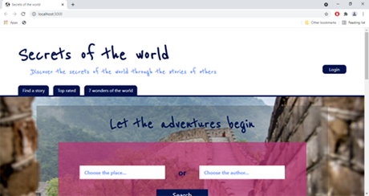
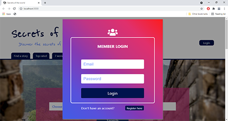
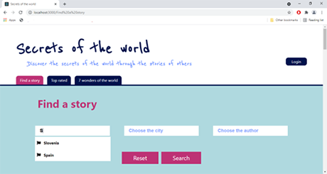
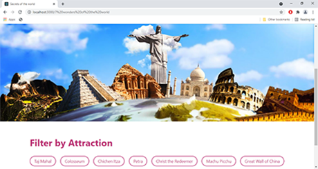

# Secrets of the World

This project was created as a part of my **bachelor thesis**.

---

### Table of content

- [Description](#item-one)
- [Features](#item-two)
- [Design](#item-three)
  - [Landing Page](#item-three-one)
  - [Find a Story Page](#item-three-two)
  - [7 Wonders Page](#item-three-three)
- [Technologies](#item-four)

## Description

The topic of this bachelor thesis is _The Development of a System for Researching World Destinations through Travelogues_.

Most of the time, when people go on a trip, they study and read the reactions of people who have visited that place to know it better, and not believe in the leaflets and marketing advertisements of tourist boards and anyone else who promotes these destinations. Because of this, the idea of ​​this application is to bring world locations closer through stories, i.e. travelogues, in a true way through the experience of others.

The bachelor thesis can be divided into two parts, theoretical and practical part. The first part is theoretical, it describes technologies that are used in creating the application, namely **React**, **Node.js**, **Express** and **MongoDB**.

The second part of the undergraduate thesis describes the development of a system. The mentioned technologies were used in the development, so React was used on the client side, Node.js and Express on the server side, and MongoDB was used as a database.

The whole project was committed in one commit because during the development I didn't think I would want to push it one day.

## Features

A few of the things you can do with Secrets of the World:

- publish travelogues
- read or search stories
- view the top-rated and the most-viewed stories
- view stories written about the destination listed in the Seven Wonders of the World
- log in and make the user profile
- user can delete and edit already published stories

## Design

#### Landing Page

The application is divided into two parts, one for registered users and the other for non-registered users.

Use is limited for unregistered users.

In the navigation bar, Find a Story, Top Rated and 7 Wonders tabs are available to a non-registered user, while a registered user can also visit My Stories and Add a New Story. The registered user is shown his username in the upper right corner, if he moves the mouse over the name, a drop-down menu is displayed through which he can access his profile, the My profile page or log out.

When the login button is clicked, a pop-up window opens where users enter their details.

#### Find a Story Page

On _Find a story_ the user can search for stories according to three parameters: country, city and author.

If the user, for example, starts writing a country and enters the letter S, all the countries for which there is a story in the database with that letter are displayed below the entry rectangle. Let the user choose Slovenia and start entering the city he wants then only cities in Slovenia will be offered to him, the same applies to the author.

#### 7 Wonders Page

The user is shown a picture of the seven wonders of the world, a filter and stories whose destination belongs to the seven wonders of the world.

As soon as that page is loaded, all stories are visible, but the user can filter the display by selecting a specific tag, in which case only stories with the selected tag are displayed.

## Technologies

- React
- Node.js
- Express
- MongoDB
